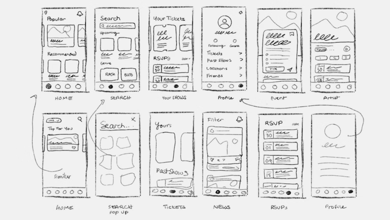
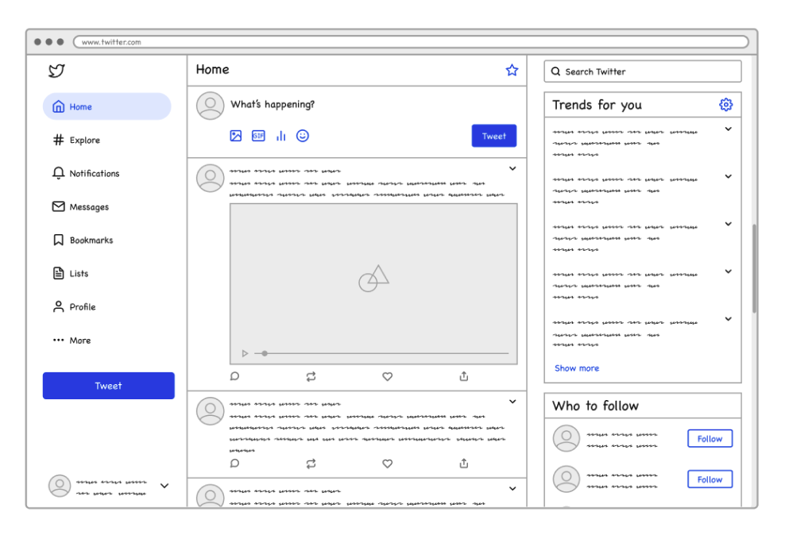
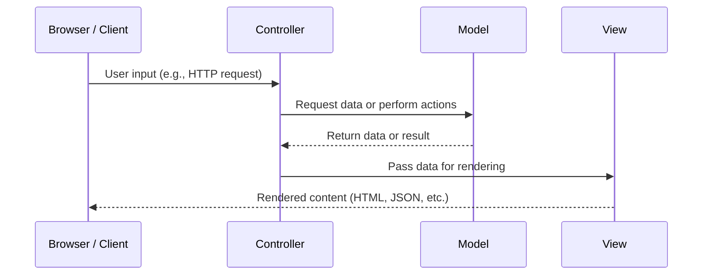
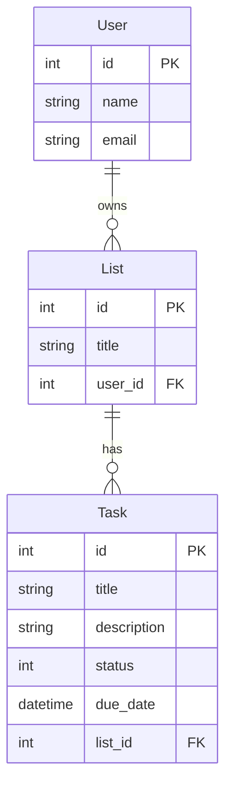

# Jellyfish CTD RoR Course

- [Week 12 - May 28 2025](#week-12---may-28-2025)
  - [Authorization: Role-Based Access Control](#authorization-role-based-access-control)
    - [ActiveRecord::Enums](#activerecordenums)
    - [Adding RBAC to Our App](#adding-rbac-to-our-app)
      - [Define the Enum in the `User` Model](#define-the-enum-in-the-user-model)
      - [Using the Enum](#using-the-enum)
    - [Role-Based Access in Controllers](#role-based-access-in-controllers)
  - [Restricting Who Can Do What To What](#restricting-who-can-do-what-to-what)
    - [Add a Helper Method](#add-a-helper-method)
    - [Use the Helper in Views to Protect Rendering](#use-the-helper-in-views-to-protect-rendering)
    - [Protect Controller Actions](#protect-controller-actions)
  - [RBAC-Related Ruby Gems](#rbac-related-ruby-gems)
- [Week 11 - May 21 2025](#week-11---may-21-2025)
  - [Authentication vs Authorization](#authentication-vs-authorization)
  - [Authentication for Web Applications](#authentication-for-web-applications)
    - [Authentication Methods](#authentication-methods)
    - [Security Best Practices: Password Authentication](#security-best-practices-password-authentication)
      - [Use secure password storage](#use-secure-password-storage)
      - [Enforce strong password policies](#enforce-strong-password-policies)
      - [Rate-limit authentication endpoints](#rate-limit-authentication-endpoints)
      - [Transport security](#transport-security)
      - [Email verification](#email-verification)
      - [Password Reset Security](#password-reset-security)
      - [Monitoring and Logging](#monitoring-and-logging)
      - [Avoid Common Pitfalls](#avoid-common-pitfalls)
  - [Stateless Vs Stateful Authentication](#stateless-vs-stateful-authentication)
    - [Stateful Authentication](#stateful-authentication)
    - [Stateless Authentication](#stateless-authentication)
  - [Implementing Session-based Authentication in Rails](#implementing-session-based-authentication-in-rails)
- [Week 10 - May 14 2025](#week-10---may-14-2025)
  - [Validations Review](#validations-review)
  - [Error Handling](#error-handling)
    - [Ruby Blocks Review](#ruby-blocks-review)
    - [Error Handling with `begin` / `rescue`](#error-handling-with-begin--rescue)
      - [Optional: `else` and `ensure`](#optional-else-and-ensure)
    - [Raising Exceptions](#raising-exceptions)
    - [Error Handling in Controllers](#error-handling-in-controllers)
    - [Rendering Errors to Users](#rendering-errors-to-users)
      - [Model#errors](#modelerrors)
      - [ActionDispatch::Flash](#actiondispatchflash)
      - [Hotwire/Turbo Error Rendering Problems](#hotwireturbo-error-rendering-problems)
- [Week 9 - May 7 2025](#week-9---may-7-2025)
  - [Writing Data: `POST` and `PUT`](#writing-data-post-and-put)
  - [Forms, Partials](#forms-partials)
    - [Creating a Form](#creating-a-form)
    - [Using Partials](#using-partials)
  - [Validations](#validations)
- [Week 8 - April 30 2025](#week-8---april-30-2025)
  - [Displaying Data](#displaying-data)
    - [Creating the route](#creating-the-route)
    - [Creating the Controller](#creating-the-controller)
    - [Coming up with a layout](#coming-up-with-a-layout)
    - [Working with ERB](#working-with-erb)
      - [ERB Syntax Overview](#erb-syntax-overview)
      - [Writing the Template](#writing-the-template)
- [Week 7 - April 23 2025](#week-7---april-23-2025)
- [Week 6 - April 16 2025](#week-6---april-16-2025)
  - [Request-Response Cycle](#request-response-cycle)
  - [REST APIs](#rest-apis)
  - [REST vs CRUD: _What's the Difference?_](#rest-vs-crudwhats-the-difference)
  - [HTTP Methods](#http-methods)
  - [Model View Controller](#model-view-controller)
  - [**Model**](#model)
  - [**View**](#view)
  - [**Controller**](#controller)
  - [Defining Routes](#defining-routes)
- [Week 5 - April 9 2025](#week-5---april-9-2025)
  - [A Quick Detour: Blocks in Ruby](#a-quick-detour-blocks-in-ruby)
    - [Multiline Block](#multiline-block)
    - [Single line block](#single-line-block)
    - [Arguments in Blocks](#arguments-in-blocks)
  - [Writing Tests](#writing-tests)
    - [Why do we test?](#why-do-we-test)
    - [What do we test?](#what-do-we-test)
  - [RSpec](#rspec)
    - [`describe`, `context`, `it` Blocks](#describe-context-it-blocks)
    - [Matchers](#matchers)
    - [Hooks](#hooks)
  - [Test-Driven Development](#test-driven-development)
    - [Benefits of TDD](#benefits-of-tdd)
- [Week 4 - April 2 2025](#week-4---april-2-2025)
  - [Data modeling: How to decide on models and relationships for our apps?](#data-modeling-how-to-decide-on-models-and-relationships-for-our-apps)
    - [Example: Task Management/To Do List App](#example-task-managementto-do-list-app)
    - [Example: Library Management App](#example-library-management-app)
  - [Rails app project structure](#rails-app-project-structure)
  - [Rails Initialization Order](#rails-initialization-order)
- [Week 3 - March 26 2025](#week-3---march-26-2025)
- [Week 2 - March 19 2025](#week-2---march-19-2025)
  - [Rails vs SQL](#rails-vs-sql)
    - [Create a table](#create-a-table)
      - [Rails](#rails)
      - [SQL](#sql)
    - [Create records](#create-records)
    - [Update records](#update-records)
- [Week 1 - March 12 2025](#week-1---march-12-2025)
  - [Variables in Ruby](#variables-in-ruby)
    - [Type Safety in Ruby](#type-safety-in-ruby)
  - [Outputting to the Console](#outputting-to-the-console)
  - [String Interpolation](#string-interpolation)
  - [Ruby Methods](#ruby-methods)
    - [What is a Method?](#what-is-a-method)
    - [Declaring Methods](#declaring-methods)
    - [Method Invocation](#method-invocation)
    - [Default Arguments](#default-arguments)
    - [Implicit Return](#implicit-return)
  - [Scope in Ruby](#scope-in-ruby)
  - [Ruby Blocks](#ruby-blocks)
  - [Classes](#classes)
  - [Instances](#instances)

## Week 12 - May 28 2025

### Authorization: Role-Based Access Control

Once users are authenticated, the next critical step is **authorization** — determining what each user is allowed to do within your application. A common and scalable approach to managing permissions is **Role-Based Access Control** (RBAC).

RBAC organizes users into roles (such as `admin`, `editor`, or `viewer`), and assigns permissions to those roles rather than to individual users. This makes it easier to manage access across large systems, reduce duplication, and enforce consistent security policies.

#### [ActiveRecord::Enums](https://api.rubyonrails.org/classes/ActiveRecord/Enum.html)

An **enum** in Rails is a way to map symbolic names (like `:admin`, `:user`, `:guest`) to integer values in the database. This lets you store compact data (as integers) while working with meaningful labels in your application code.

Given this in a model:

```ruby
enum role: { user: 0, admin: 1 }
```

Rails provides:

1. Predicate methods:
   `user.admin?` → `true` or `false`

2. Setter and getter:
   `user.role = :admin`
   `user.role` → `"admin"`

3. Scopes:
   `User.admin` → all users with the admin role

---

#### Adding RBAC to Our App

Generate a migration:

```bash
rails generate migration AddRoleToUsers role:integer
```

Then run the migration:

```bash
rails db:migrate
```

##### Define the Enum in the `User` Model

Open `app/models/user.rb` and add:

```ruby
class User < ApplicationRecord
  enum role: { user: 0, admin: 1 }
end
```

This defines named roles that are stored as integers in the database.

##### Using the Enum

You can now use enum helpers:

```ruby
user = User.create(role: :user)

user.admin?    # => false
user.user?   # => true

user.role      # => "user"
user.role = :admin
user.save
```

Scopes are also available:

```ruby
User.admin    # returns all admin users
User.user   # returns all user users
```

#### Role-Based Access in Controllers

Use conditionals to restrict access:

```ruby
before_action :require_admin

def require_admin
  redirect_to root_path unless current_user&.admin?
end
```

### Restricting Who Can Do What To What

In a typical Rails app with User and Post models, we want to apply role-based and ownership-based access control. A user should only be able to edit or delete a post if they:

1. are an admin, or
2. are the author of that post

We want to guard against that, and leverage our RBAC at the same time.

#### Add a Helper Method

**Helper methods** in Rails are methods used to extract reusable logic for views. They make your view templates cleaner, more readable, and easier to maintain.

Rails encourages keeping business logic in models and controllers, and keeping views as simple as possible. When you find logic creeping into your views (like conditionals, formatting, or permission checks), it's a good candidate for a helper method.

By default, Rails includes:

- `app/helpers/application_helper.rb` – shared across all views
- Controller-specific helpers, like `posts_helper.rb` for views related to `PostsController`

We are going to add an method to `PostsHelper` to control access to the management-tasks for `Posts`

```ruby
# app/helpers/posts_helper.rb
module PostsHelper
  def can_manage_post?(user, post)
    user&.admin? || post.user_id == user&.id
  end
end
```

This method returns true if the user is an admin or the author of the post.

#### Use the Helper in Views to Protect Rendering

In post card view, we will wrap the edit/delete links with the permission check:

```ruby
# app/views/posts/_post_card.html.erb
<% if can_manage_post?(current_user, post) %>
  <div class="post-actions">
    <%= link_to "Edit", edit_post_path(post), class: 'button' %>
    <%= link_to "Delete", post_path(post), data: { turbo_method: :delete }, class: 'button delete' %>
  </div>
<% end %>
```

#### Protect Controller Actions

In addition to protecting our views, we also need to protect our endpoints. This ensures that unauthorized users can’t access restricted actions by bypassing the UI.

```ruby
# app/controllers/posts_controller.rb
before_action :set_post, only: [:edit, :update, :destroy]
before_action :authorize_post!, only: [:edit, :update, :destroy]

private

def authorize_post!
  unless current_user&.admin? || @post.user_id == current_user&.id
    redirect_to root_path, alert: 'You are not authorized to perform this action.'
  end
end
```

### RBAC-Related Ruby Gems

- [cancancan](https://github.com/CanCanCommunity/cancancan)
- [Pundit](https://github.com/varvet/pundit)

---

## Week 11 - May 21 2025

### Authentication vs Authorization

Authentication and Authorization are related, but separate concepts that can be easily confused.

| Concept        | Definition                                                                  |
| -------------- | --------------------------------------------------------------------------- |
| Authentication | Verifying **who the user is** (login, password check).                      |
| Authorization  | Verifying **what the user is allowed to do** (permissions, access control). |

> **Example**
>
> - Authentication: Logging in as `alice@example.com`
> - Authorization: Checking if Alice can edit a particular post.

### Authentication for Web Applications

Authentication is a constantly evolving field in today’s digital landscape.

#### Authentication Methods

From traditional passwords to passkeys, OmniAuth, multi-factor authentication, and biometric verification, developers are continually adapting to ensure they can confidently verify who is accessing their applications. As threats grow more sophisticated, maintaining this assurance is critical to protecting user data and assets from malicious actors.

#### Security Best Practices: Password Authentication

Email/Username and passwords remain the most popular choice. However, it is important to understand a few things about handling passwords in your web application.

##### Use secure password storage

Passwords must be stored using a strong hashing algorithm and should NEVER be stored as plain text.

##### Enforce strong password policies

The National Institute of Standards and Technology provides [explicit guidance](https://pages.nist.gov/800-63-3/sp800-63b.html) on enforcing strong password policies. These are:

- Minimum 8 characters in length
- Allow at least 64 characters in length
- Accept ASCII and Unicode characters
- Do not provide password hints
- "Compare against a list that contains values known to be commonly-used, expected, or compromised."
- Provide reason for rejection of new password that does not meet requirements
- Do not arbitrarily recommend changing passwords (eg. expiring pw after `n` days)
- Do not impose other composition rules (e.g., requiring mixtures of different character types or prohibiting consecutively repeated characters)
- Store passwords salted and hashed appropriately

##### Rate-limit authentication endpoints

- Implement rate-limiting on login attempts using [Rack::Attack](https://github.com/rack/rack-attack) or other rate-limiting middleware

##### Transport security

- Always use HTTPS to encrypt data in transit
- Secure cookies with `Secure`, `HttpOnly`, and `SameSite` attributes

##### Email verification

- Require users to verify their email during registration

##### Password Reset Security

- Use single-use, time-limited tokens for resetting passwords
- Invalid tokens after use
- Invalid sessions on password change

##### Monitoring and Logging

- Log authentication events (logins, failed logins, password changes)
- Track IP and User-Agent behavior with authentication events

##### Avoid Common Pitfalls

- Do not output secure information in logs or error messages
- Do not use `GET` requests on authentication endpoints
- Do not confirm the existence of a user on login or password reset errors

---

### Stateless Vs Stateful Authentication

As applications grow more complex and distributed, the way we manage user authentication must adapt accordingly. One of the fundamental architectural decisions developers face is whether to use **stateful** or **stateless** authentication.

Both approaches aim to verify and maintain a user’s identity across requests — but they do so in very different ways, each with its own trade-offs in terms of scalability, security, performance, and ease of implementation.

#### Stateful Authentication

In stateful authentication, the server maintains **session** state — typically by storing a session identifier (like a session ID) in memory or a database after a user logs in. The client (usually a browser) holds a session cookie and sends it with each request, allowing the server to look up the session and authenticate the user.

**Sessions + Cookies**, which we will implement in our Rails application, is an example of Stateful Authentication

Pros:

- Simple to implement in server-rendered apps
- Easier to invalidate sessions (e.g., logging out, expiring sessions)
- Better control over session lifecycle and user behavior

Cons:

- Doesn’t scale easily across multiple servers unless you centralize session storage
- Requires session store management (memory, cache, or DB)

#### Stateless Authentication

In stateless authentication, the server does not store any session information. Instead, all authentication data is self-contained in the token (e.g., **JWT**). The client includes the token in each request (typically via the `Authorization` header), and the server verifies the token's signature to authenticate.

**JSON Web Tokens (JWT)** are a common example of stateless authentication.

Pros:

- Horizontally scalable — no centralized session state required
- Ideal for APIs and microservices
- Reduces server-side memory or session store load

Cons:

- More complex token management (e.g., expiration, renewal, revocation)
- Cannot easily invalidate a token unless using a token blacklist or short TTL
- Larger payload size in each request (token must include all necessary data)
- Higher potential to be less secure

---

### Implementing Session-based Authentication in Rails

- Install the `bcrypt` Gem
- Add the `:password_digest` attribute to our `User` model with a migration
- Add `has_secure_password` to the `User` model
- Create a SessionsController
- Implement views

---

## Week 10 - May 14 2025

### Validations Review

- What is the difference between `#create` and `#create!`?
- Adding validations to our models
- Validator methods
  - `#valid?`
  - `#save?`
- [`ActiveModel::Dirty`](https://api.rubyonrails.org/classes/ActiveModel/Dirty.html)

### Error Handling

#### Ruby Blocks Review

> Resource: [A Quick Detour: Blocks in Ruby](#a-quick-detour-blocks-in-ruby)

#### Error Handling with `begin` / `rescue`

Ruby provides built-in exception handling using a `begin` block followed by one or more `rescue` clauses. This allows you to handle runtime errors gracefully.

```ruby
begin
  # Code that might raise an error
rescue SomeErrorClass => e
  # Code that runs if that specific error occurs
end
```

You can handle different types of exceptions separately:

```ruby
begin
  risky_operation
rescue ArgumentError
  puts "There was an argument error."
rescue RuntimeError
  puts "There was a runtime error."
rescue => e
  puts "Some other error occurred: #{e.class} - #{e.message}"
end
```

In this example, if none of the earlier specific errors match, the final `rescue => e` clause catches any other kind of exception.

##### Optional: `else` and `ensure`

`else` runs if no exceptions are raised, while `ensure` always runs, whether an exception occurs or not.

```ruby
begin
  puts "Trying something..."
  # code here
rescue => e
  puts "Error: #{e.message}"
else
  puts "No errors encountered."
ensure
  puts "This will always run."
end
```

Ruby implicitly wraps the body of a method in a `begin ... end` block behind the scenes, so you don't need to add `begin` to `rescue` inside a method:

```ruby
def divide(a, b)
  result = a / b
rescue ZeroDivisionError
  puts "You can't divide by zero."
end
```

#### Raising Exceptions

You can raise an exception manually using `raise`:

```ruby
raise "Something went wrong"
```

Or with a specific exception type:

```ruby
raise ArgumentError, "Invalid argument provided"
```

#### Error Handling in Controllers

We have a couple of options for handling errors in our controllers. If we want to use `!` methods, we will need to `rescue` from errors in the controller methods:

```ruby
def update
  @post = Post.find(params[:id])
  @post.update!(post_params)

  redirect_to @post
rescue ActiveRecord::RecordInvalid => e
  render :edit
end
```

Alternatively, we can check for errors in the controller on the model instance using `#valid?`

```ruby
def update
  @post = Post.find(params[:id])
  @post.update(post_params)

  if @post.valid?
    redirect_to @post, notice: "Post created successfully."
  else
    render :edit
  end
end
```

#### Rendering Errors to Users

To render errors in our views, we have a couple of options:

- `Model#errors`
- [`ActionDispatch::Flash`](https://api.rubyonrails.org/classes/ActionDispatch/Flash.html)

##### Model#errors

To render the errors from a model in a view, we need to set up the controller to catch the errors and handle them separately from a success.

> REMEMBER: `#new` makes a `POST` request to `#create`, while `#edit` makes a `PUT` request to `#update`

In our `#create` action:

```ruby
def create
  @post = current_user.posts.create!(post_params)

  redirect_to @post
rescue ActiveRecord::RecordInvalid => e
  @post = e.record
  render :new, status: :unprocessable_entity
end
```

In the `new.html.erb` view, we need to have some conditional rendering for an error notification, that renders only when `#errors` are present on our `Post` instance.

Since we are using a partial, `_form.html.erb`, we will make the change there so that it also works for our `#edit` view:

```ruby
<%= form_with model: post, data: { turbo: false }, html: { class: "post-form" } do |form| %>

  <% if post.errors.any? %>
    <div class="form-errors">
      <h2><%= pluralize(post.errors.count, "error") %> prohibited this post from being saved:</h2>
      <ul>
        <% post.errors.full_messages.each do |msg| %>
          <li><%= msg %></li>
        <% end %>
      </ul>
    </div>
  <% end %>

  <%# ...  %>
<% end %>
```

##### ActionDispatch::Flash

ActionDispatch::Flash allows us to pass information between Controller actions, and can be used for a number of things beyond error handling, including success notifications, or generic notices.

To render errors using `Flash`, we need to add the error to the `FlashHash` in the controller so that our view template can render it.

> **NOTE:** This is an **alternative** to the above example-- You do not need to, *nor should you*, do both. Pick the one you like and stay consistent!

We will use the `#update` action this time:

```ruby
def update
  @post = Post.find(params[:id])
  @post.update!(post_params)

  redirect_to @post
rescue ActiveRecord::RecordInvalid => e
  @post = e.record
  render :edit, status: :unprocessable_entity
end
```

##### Hotwire/Turbo Error Rendering Problems

⚠️ IMPORTANT!: Starting in Rails 7, Rails ships with Hotwire, which breaks some of the idioms for rendering errors. You may come across instructions for displaying `flash` errors or displaying the `Model#errors` in the view that do not cover this change.

To display errors in a Full-Stack Rails app running Rails >=7, you must either:

Return `:unprocessable_entity` as the status in the controller:

```ruby
def update
  @my_model = MyModel.find(params[:id])
  @my_model.update!(my_model_params)

  redirect_to @my_model
rescue ActiveRecord::RecordInvalid => e
  @post = e.record
  render :edit, status: :unprocessable_entity
end
```

Or, add `data: { turbo: false }` to your `form` declaration in the view:

```ruby
<%= form_with model: @my_model, data: { turbo: false } do |form| %>
# ...
```


We can also rescue at a higher level in our controllers to "DRY" our error handling with `rescue_from`

```ruby
class PostsController < ApplicationController

  rescue_from ActiveRecord::RecordInvalid, with: :render_invalid

  private

  def render_invalid(e)
    
  end
end
```

## Week 9 - May 7 2025

### Writing Data: `POST` and `PUT`

- `POST` - used to create a resource (`#create` action)
- `PUT` - used to edit a resource (`#update` action)

### Forms, Partials

#### Creating a Form

```ruby
# app/views/posts/new.html.erb

<h1 class="page-title">New Post</h1>
<%= form_with model: @post, html: { class: "post-form" } do |form| %>
  <div class="form-group">
    <%= form.label :title, class: "form-label" %>
    <%= form.text_field :title, class: "form-input" %>
  </div>

  <div class="form-group">
    <%= form.label :body, class: "form-label" %>
    <%= form.text_area :body, rows: 6, class: "form-input" %>
  </div>

  <div class="form-actions">
    <%= form.submit "Save Post", class: "form-submit" %>
  </div>
<% end %>
```

#### Using Partials

Partials are reusable view fragments that allow us to keep our view files DRY *(Don't Repeat Yourself)*.

To create a partial, generate a view file that is prefixed with an `_` underscore, eg. `app/views/posts/_form.html.erb`

```ruby
# app/views/posts/_form.html.erb

<%= form_with model: @post, html: { class: "post-form" } do |form| %>
  <div class="form-group">
    <%= form.label :title, class: "form-label" %>
    <%= form.text_field :title, class: "form-input" %>
  </div>

  <div class="form-group">
    <%= form.label :body, class: "form-label" %>
    <%= form.text_area :body, rows: 6, class: "form-input" %>
  </div>

  <div class="form-actions">
    <%= form.submit "Save Post", class: "form-submit" %>
  </div>
<% end %>
```

To include a partial in a view, use the `#render` method

```ruby
# app/views/posts/new.html.erb
<h1 class="page-title">New Post</h1>
<%= render "form" %>
```

Your partial can receive local variables, called `locals`, as a hash:

```ruby
# app/views/posts/show.html.erb

<h1 class="page-title"><%= @post %></h1>
<%= render partial: "post_card", locals: { post: @post } %>
<%= link_to "Edit", edit_post_path(@post) %>
```

### Validations

- Resource: [ActiveRecord Validations](https://guides.rubyonrails.org/active_record_validations.html)

**Active Record validations** are built-in ActiveRecord mechanisms that help ensure only valid data is saved to your database. They are defined in your model classes (e.g., `Post`, `User`) and automatically run before `#create`, `#update`, or `#save`.

Without validations, you might save records with missing or incorrect data (e.g. an empty title).

```ruby
class Post < ApplicationRecord
  belongs_to :author, class_name: "User"

  validates :title, presence: true, length: { minimum: 5 }
  validates :body, presence: true
end
```

## Week 8 - April 30 2025

### Displaying Data

Personally, I prefer to understand how the data you receive will be shaped before beginning to imagine how to build the page. Let's look at our Post data.

When we last left off, we had defined the routes for the `Post` model, and set up some controller actions for them that rendered the Posts as `json`.

For now, we are going to focus on the **`#index`** action for `Post`.

If we navigate to our `/posts` endpoint right now, we'll see something like this:

```json
[
  {
    "id": 1,
    "title": "A Title",
    "body": "Fine. heres a body",
    "created_at": "2025-04-10T00:31:23.340Z",
    "updated_at": "2025-04-10T00:31:23.340Z",
    "author_id": 1
  },
  {
    "id": 2,
    "title": "This is a new post",
    "body": "this is a new body",
    "created_at": "2025-04-17T00:45:41.393Z",
    "updated_at": "2025-04-17T00:45:41.393Z",
    "author_id": 1
  },
]
```

But what if we want to show the data in a more fun, appealing way? We're ready to learn a bit more about the **View** part of our Model-View-Controller application.

Before we do, let's refresh our steps from last time:

#### Creating the route

Let's create some route for the Post Model. In `config/routes.rb`, we will add a definition for the routes:

```ruby
resources :posts
```

This creates all of the CRUD routes for the `Post` model. We could just create the route for the `#index` action by specifying `only: :index` after the `resources :posts` definition, however, we know we want to support the other CRUD actions, too.

> **Remember**: An `#index` route should return a collection of resources. (See [Week 6](#week-6---april-16-2025) for a refresher)

#### Creating the Controller

We will create a controller action to handle this route in the `PostsController` (`/app/controllers/posts_controller.rb`)

We want to retreive all of the `Post` records, with the newest records showing first.

```ruby
class PostsController < ApplicationController
  def index
    @posts = Post.all.order(created_at: :desc)
  end
end
```

#### Coming up with a layout

This is what your lesson refers to as *wireframing*. You can do this using tools like Figma or Moqup, or by hand with pen and paper.

It is nice to have a general sense of how the page should be laid out before you start writing your view. In the enterprise world, a UX designer will provide an developer with designs for the page they are expected to build.


> [Image Credit](https://www.behance.net/gallery/96544243/Bandsintown-Mobile-App-Redesign?tracking_source=project_owner_other_projects)



#### Working with ERB

After we are sure of the layout, we can start to write our view template. Out of the box, Rails ships with **ERB**, or Embedded Ruby, as its templating language for defining views.

ERB lets us write Ruby code within an HTML file, which Rails uses to generate dynamic content for our application.

##### ERB Syntax Overview

An ERB file is *mostly HTML,* but there are two important syntax distinctions to note about using ERB:

1. `<% %>` - Run Ruby code without output
   This is used for control flow, loops, and conditionals, where we do not wish the output to render anything, itself

   ```erb
   <% @posts.each do |post| %>
    ...
   <% end %>
   ```

2. `<%= %>` — Run Ruby Code and output the result
   This inserts the result of our Ruby code into the HTML

   ```erb
   <h2><%= @post.title %></h2>
   ```

##### Writing the Template

> 💡 **FYI**: You may have noticed the `@var` we declared in the controller. The instance variables we declare in our controllers are available in our views. This means we can call `@posts` in our ERB file, and receive the value stored under that variable.

```erb
<h1 class="page-title">Posts</h1>

<div class="posts-list">
  <% @posts.each do |post| %>
    <div class="post-card">
      <h2 class="post-title"><%= post.title %></h2>
      <div class="post-meta">
        By: <%= post.author %> (<em><%= post.created_at.strftime("%B %d, %Y") %></em>)
      </div>
      <div class="post-body">
        <%= truncate(post.body, length: 200) %>
      </div>
    </div>
  <% end %>
</div>
```

---

## Week 7 - April 23 2025

NO MENTOR SESSION

---

## Week 6 - April 16 2025

**At its most basic, the primary responsibility of Rails is to take an HTTP request and generate a properly formatted Response.**

We do this by defining routes, creating a controller to handle those routes and creating a template for rendering the data for that route.

### Request-Response Cycle

1. User goes to `https://codethedream.org/` in their web browser
2. A DNS Lookup is performed.
   1. The browser checks its cache or sends a request to a **Domain Name System (DNS)** server to resolve the domain to an IP address. DNS is like the phonebook of the internet: It maps domain names to IP addresses.
      1. This is a simplification of how DNS lookup works, but understanding the process of DNS is worth the read. Check out this [article from Cloudflare on DNS](https://www.cloudflare.com/learning/dns/what-is-dns/) for more information.
   2. You can look up the IP address of a website with `nslookup [URL]` in your terminal
3. The browser opens a **TCP (transmission control protocol)** connection to the server.
4. A **TLS (Transport Layer Security**, formerly known as Secure Sockets Layer or SSL) handshake is performed between the client (browser) and the server
5. The HTTP request is sent to the server: `GET /`
6. The server receives the request
7. The response is built*
8. The response is sent back as an HTTP response to the client

Building the response is where your Rails Application comes in, and it's definitely more complex than a single sentence. We will come back to that shortly, but for now, let's review some backend concepts.

### REST APIs

- What is an API?
  - _Application Programming Interface_ is a software intermediary whose job is to allow two computers to communicate with one another.
- What is REST?
  - REST stands for "REpresentational State Transfer". It is an architectural style, often applied to APIs, used to create a reliable, high-performance application with a simple, layered interface.
- What is CRUD?
  - _Create, Read, Update, and Delete_ is an acronym that explains the four standard commands for interacting with databases.

### REST vs CRUD: _What's the Difference?_

It can be easy to confuse REST and CRUD, especially when it feels like they're used interchangeably at times, but in simplest terms: REST refers to the structural design of the API while CRUD defines manners in which we may interact with it.

If you're a metaphor person:

- API is your local library, allow you and your favorite books to interact
- REST is the way your local library organizes its books
- CRUD is the set of actions you can take with library resources
- HTTP is the library's process for you to access their resources.
  - No library card might result in `403 Forbidden`

### HTTP Methods

With RESTful APIs, the CRUD functions can be equated with _HTTP Methods_ (also called "_HTTP verbs_") that developers use to interact with the API.

| HTTP Methods | CRUD          | Action                                                                                                                                    |
| ------------ | ------------- | ----------------------------------------------------------------------------------------------------------------------------------------- |
| **GET**      | Read          | Retreives data                                                                                                                            |
| **POST**     | Create        | Creates a new resource                                                                                                                    |
| **PATCH**    | Update        | Makes partial update to an existing resource                                                                                              |
| **PUT**      | Update/Create | Updates entire representation of an exisiting resource **OR** Creates a new resource if the client supplies an ID that does not yet exist |
| **DELETE**   | Delete        | Deletes a resource                                                                                                                        |

### Model View Controller

Rails is a Model-View-Controller (MVC) framework. MVC is a software design pattern used for developing applications that divide the program logic into three interconnected elements: The **model**, **view**, and **controller**.

### **Model**

- **What it does:** Handles the **data** and **business logic**.
- **Responsibilities:**
  - Manages the state of the application.
  - Interacts with the database or API.
  - Enforces rules, validations, and calculations.
- **Example:** In a blog app, a `Post` model might define what a post is, ensure it has a title and body, and connect to the database to fetch or save posts.

### **View**

- **What it does:** Handles the **user interface**.
- **Responsibilities:**
  - Presents data to the user.
  - Displays HTML, JSON, or any UI format.
  - Doesn’t contain business logic.
- **Example:** A template that shows a list of blog posts in HTML.

### **Controller**

- **What it does:** Acts as the **go-between** for the Model and the View.
- **Responsibilities:**
  - Receives user input (like form submissions or URL requests).
  - Tells the model what to do (e.g., save a new post).
  - Chooses the correct view to render in response.
- **Example:** A `PostsController` might have an action like `create` that takes form input, creates a new post via the model, and then redirects or renders a view.



### Defining Routes

- [Rails Routing from the Outside In](https://guides.rubyonrails.org/routing.html)

Routes are defined in our `config/routes.rb` file:

```ruby
Rails.appplication.routes.draw do
  get "/dogs", to: "dogs#index"

  resources :posts do
    resources :comments
  end
end
```

> 💡FYI We can see all of the routes that exist in our rails app in local development by visiting `http://localhost:3000/rails/info/routes` or by running `rails routes` in our terminal!

---

## Week 5 - April 9 2025

### A Quick Detour: Blocks in Ruby

A **block** is an encapsulated piece of code. It's like an anonymous function or a *closure*. Blocks are used all over Ruby, especially in iterators!

> FYI: You can run any of the below examples in your Interactive Ruby Console by running `irb` in your terminal! (see [IRB github](https://github.com/ruby/irb))

#### Multiline Block

Multi line blocks are defined with `do...end`

```ruby
3.times do
  puts "Hello from a multi line block!"
end
```

#### Single line block

Single line blocks are defined with `{}`

```ruby
3.times { puts "Hello from a multi line block!" }
```

#### Arguments in Blocks

Arguments for blocks are passed between pipe characters `|`

```ruby
array = [1,2,3]

array.each_with_index do |num, index|
  puts num, index
end
```

### Writing Tests

#### Why do we test?

- Ensure code behaves as expected
- Catch bugs early
- Document expected behavior
- Enable safe refactoring
- Confidence in deploying code
- Easier collaboration
- Fewer regressions
- Faster feedback loop in development

#### What do we test?

- Models
- Controllers
- Views
- Integrations

Typically, we pattern test files that match our application files, 1:1 (eg. *If we have a user model file, we have a user model test file*)  

### RSpec

- A gem for writing tests in Ruby
- Has a rails specific integration `rspec-rails`
- Uses a Domain Specific Language (DSL) which is sort of like a mini-programming language built using another programming language to communicate commands to a computer

> :star: MUST READ: https://www.betterspecs.org/ 
>
> This is by far the most valuable resource about how to write quality tests in Rspec that I have ever found!
> I highly recommend reading this!

#### `describe`, `context`, `it` Blocks

- `describe` - Used to group tests together
- `context` - express conditions or states
- `it` - defines individual test cases

```ruby
Rspec.describe User do
  context "when user is an admin" do
    it "return true for #admin?" do
      user = User.new(role: "admin")
      expect(user.admin?).to be true
    end
  end
end
```

#### Matchers

- `eq` - equals
- `be_truthy`
- `exist`
- `change`
- and more...see [Rspec Documentation](https://rspec.info/documentation/3.9/rspec-expectations/RSpec/Matchers.html)

```ruby
Rspec.describe "Math" do
  it "adds numbers correctly" do
    expect(2 + 2).to eq(4)
  end
end
```

#### Hooks

Hooks help keep tests DRY (*do not repeat yourself*)

- `before` - defines a setup block before a test, for any actions that may need to happen before test run
- `let`/`let!` - defines variables for our test blocks, `let` is lazy loaded, meaning it will never be instanciated if it is never called in the code that follows
- `subject` - define the main object that we are testing

### Test-Driven Development

Test Driven Development is where we write tests before we write our application code!

- **Red-Green-Refactor**
  - **Red**: Write failing tests
  - **Green**: Write minimum code to make tests pass
  - **Refactor**: Clean-up code, add more tests if necessary

#### Benefits of TDD

- Forces thoughtful design
- Encourages writing only necessary code
- Leads to better test coverage

---

## Week 4 - April 2 2025

### Data modeling: How to decide on models and relationships for our apps?

#### Example: Task Management/To Do List App

- Models
  - Task
    - title
    - description
    - status
    - due date
    - belong to a list
  - User
    - name
    - email
  - List
    - title
    - belong to a user



#### Example: Library Management App

- Models
  - Book
  - Section(Genre, DewDecimal)
  - Author
  - Member (User)
  - BorrowRecord (CheckoutHistory) (Loan)
- Relationships

### Rails app project structure

- `app` → Holds the core components of the application.
  - `assets` → Stores static assets like images, stylesheets, and JavaScript files.
  - `controllers` → Contains controller classes, which handle HTTP requests and coordinate model and view interactions.
  - `helpers` → Stores helper modules that provide reusable methods for `views`.
  - `javascript` → Holds JavaScript and frontend assets when using Webpacker or Import Maps.
  - `jobs` → Contains background jobs for Active Job, which allows asynchronous processing (e.g., email sending).
  - `mailers` → Defines mailer classes for sending emails using Action Mailer.
  - `models`→ Stores model classes, which interact with the database and represent business logic.
  - `views`→ Holds view templates (ERB, HAML, etc.) for rendering HTML responses.
- `bin` → Contains Rails executables like `rails`, `rake`, and `setup`. Used for running commands like `bin/rails server`.
- `config` → Stores application settings and environment configurations.
  - `environments`→ Holds environment-specific settings for `development`, `test`, and `production`.
  - `initializers` → Contains scripts that run during app initialization, such as configuring third-party gems.
- `db` → Stores database-related files, including migrations (`db/migrate/`), schema (`db/schema.rb`), and seeds (`db/seeds.rb`).
- `lib` → Holds custom Ruby modules, services, and extensions that don’t belong in `app/`
- `log` → Stores application logs, such as `development.log`, `test.log`, and `production.log`.
- `public` → Contains static files like `robots.txt`, error pages (`404.html`), and uploaded assets.
- `script` → Previously used for running scripts; now replaced by `bin/`.
- `storage` → Stores files for Active Storage, such as user uploads.
- `test` → Contains test files when using Rails' built-in test framework (`Minitest`).
- `tmp` → Stores temporary files, such as cache, PIDs, and session data.
- `vendor` → Stores third-party code and dependencies (rarely used today due to Bundler).
- `config.ru` → Rack configuration file for running the Rails app with a Rack-based server (e.g., Puma).
- `Dockerfile` → Defines instructions for containerizing the Rails app using Docker.
- `Gemfile` → Lists dependencies managed by Bundler (`gem install`).
- `Rakefile` → Defines Rake tasks for automation, such as running migrations (`rake db:migrate`).

### Rails Initialization Order

*What order to the files in our Rails app load?*
This is important to know if we add dependencies (aka *Gems*) to our app that need to be loaded in a certain order. Understanding where to insert them if you are running into trouble is valuable.

  1. `config/boot.rb`
  2. `config/application.rb`
  3. `config.ru`
  4. `config/environment.rb`
  5. `config/environments/development.rb`
  6. `config/initializers/*` (NOTE: all initializer files are loaded in order of their file name)
  7. `config/puma.rb`
  8. `config/routes.rb` (after an HTTP request is made)

## Week 3 - March 26 2025

- Active Record Associations
  - Types of Associations
    - **One-to-Many** Relationship: `belongs_to` and `has_many`
    - **One-to-One** Relationship: `belongs_to` and `has_one`
      - Drivers License → Person
    - **Many-to-Many** Relationship: `has_many :through` and `has_many`
      - Using a *join* (aka *association*, aka *relational*) *table* to create a Many-to-Many relationship
      - Teachers and Students, with a `students_teachers` join table
      - Doctors and Patients (Appointments as the join table)
    - [Polymorphic Relationships](https://guides.rubyonrails.org/association_basics.html#polymorphic-associations)
  - Object Relational Mapper (ORM)
    - ActiveRecord generates a lot of methods for us to interact with our objects without us having to define those methods
- **Active Record Migrations**
  - `bin/rails db:migrate`
  - `bin/rails db:rollback`
  - `bin/rails generate [migration | model | scaffold] ...`
  - 
- **Object Oriented Programming**
  - Building Blocks of Object-Oriented Programming
    - **Abstraction** - Take complex process and reduce it to a simple interface
    - **Polymorphism** - Allowing objects to behave differently based on their context, allowing classes to be treated as objects of a common type.
    - **Inheritance** - Child class can interit methods and properties from its parent
    - **Encapsulation** - Restricting direct access to an objects properties (getters/setters) and bundling of data with the methods that operate on that data.
  - Read more: [Introduction to Object Oriented Programming](https://www.geeksforgeeks.org/introduction-of-object-oriented-programming)

## Week 2 - March 19 2025

- `!` `?` Methods
  - Ruby has special naming convention for certain methods
  - If a method ends in an `!` it means it is "destructive" or it raises so error
    - In active record world, `!` methods raise errors when things go wrong
      - `save` will fail silently, `save!` will raise an error
  - If a method ends in a `?`, it means the return of the method is a boolean
    - `#active?` it will return `true` or `false` depending on if the instance is `active`
- Classes and Instances: Review
  - A *Class* is a blueprint
    - A class is a table in the database
  - An *instance*, or an *object*, is a class realized
    - An instance is a row in the table in the database
- Relationship modeling
  - relationship describe the **cardinality** (numerical relationship) between the rows of one table and the rows of another
    - the cardinality between objects/instances
    - Entity-Relationships, modeled visually as ERD (Entity-Relationship Diagrams)
  - `belongs_to` (one-to-many)
  - `has_many` (one-to-many) inverse of `belongs_to`
- SQL
  - SQL (Structured Query Language) is a language for maintaining and managing data in a database
  - SQL can be used with a variety of Database Systems (sqlite, MySQL, Postgres (PSQL), Oracle, etc.)
  - SQL is for *relational databases*

### Rails vs SQL

Anything Rails can do with our data models, SQL can do natively, because *secretly*, our Rails app is calling SQL for us under the hood!

You can see SQL being performed by your rails app in the log lines that print in the Rails console.

#### Create a table

##### Rails

```ruby
# db/migrate/20250319234716_create_posts.rb

class CreatePosts < ActiveRecord::Migration[8.0]
  def change
    create_table :posts do |t|
      t.string :title
      t.string :body
      t.timestamps
    end
  end
end
```

##### SQL

```sql
CREATE TABLE posts (
    id INTEGER PRIMARY KEY
    title TEXT
    body TEXT
    updated_at DATETIME
    created_at DATETIME
);
```

#### Create records

**Rails**:

```ruby
Post.create!(title: 'This is a Title', body: 'This is a body')
```

**SQL**:

```sql
INSERT INTO posts ("title", "body", "updated_at", "created_at") VALUES ('This is a Title', 'This is a body', '2025-03-19 00:00:00', '2025-03-19 00:00:00');
```

#### Update records

**Rails**:

```ruby
comment = Comment.first
comment.update!(post_id: 2)
```

**SQL**:

```sql
UPDATE "comments" SET "post_id" = 2, "updated_at" = '2025-03-20 00:20:56.993542' WHERE "comments"."id" = 1;
```

## Week 1 - March 12 2025

### Variables in Ruby

We can declare and assign a variable in Ruby like so:

```ruby
first_variable = 7
```

That's it. There is no `const`, `let`, or `var`.

Note the naming convention for Ruby variables use ***snake case***, where words are separated with an underscore (`_`).

#### Type Safety in Ruby

Similar to JavaScript, Ruby is a **dynamically-typed language**, meaning variables can change their data type at runtime and these types do not need to be explicitly defined.

However, unlike JavaScript, Ruby data types will not be implicitly coerced into other data types, and will raise errors when attempting to perform operations on inappropriate data types. You may hear this referred to as Ruby being **"strongly typed"**.

Compare the following identical operation in each language:

**JavaScript**:

```js
// dynamic reassignment of a variable to a different data type
let num = 1
num = "one"
// loose typing allows an integer to be coerced to a string
console.log(num + 1)
// => "one1"
```

**Ruby**:

```ruby
# dynamic reassignment of a variable to a different data type
num = 1
num = "one"
# raises an error because you can't add a string to an integer
puts num + 1
#=>:2:in `+': no implicit conversion of Integer into String (TypeError)
```

### Outputting to the Console

In ruby, there is no `console.log`. Instead, the `puts` and `print` methods output values to the console.

The difference between them being that the `puts` method adds a new line to the end:

```ruby
2.times { puts "Hello World!" }
# > Hello World!
# > Hello World!
2.times { print "Hello World!" }
# > Hello World!Hello World!
```

### String Interpolation

In JavaScript, we do string interpolation using backticks and dollar sign:

```js
let name = "Maria"
console.log(`Hello, ${name}.`)
// => Hello, Maria.
```

In Ruby, string interpolation uses double quotes and a hash symbol:

```ruby
name = "Maria"
puts "Hello, #{name}."
# => Hello, Maria.
```

### Ruby Methods

#### What is a Method?

A **function** is a set of instructions for a task.

A **method** is also a set of instructions for a task, associated with an object.

Since Ruby is an object-oriented programming language and *everything* is an object, Ruby only has **methods**!

#### Declaring Methods

Methods are declared with the keyword `def`:

```ruby
def say_hello
  puts "Hello"
end
```

Like other blocks in Ruby, methods are closed with the `end` keyword.

#### Method Invocation

In JavaScript, we are required to include parenthesis when invoking a function or method

```js
function sayHello() {
  console.log('Hello!')
}

sayHello()
// => Hello!
```

In Ruby, parenthesis to invoke methods are optional, provided that the argument is the last thing on the line. In fact, when a method has no arguments, using parenthesis goes against Ruby convention!

```ruby
def say_hello
  puts "Hello!"
end

say_hello
# => Hello!
```

So, while this is technically valid:

```ruby
say_hello()
```

It is best avoided in Ruby.

On the other hand, when a method takes parameters, omitting the parenthesis is unconventional, as it often makes the code more difficult to read.

```ruby
def say_hello_to(name)
  puts "Hello, #{name}!"
end

say_hello_to("Maria")
# => Hello, Maria!
```

There are occasional exceptions to this standard, one of which you have seen many times in this lesson already: `puts`!

`puts` is a method that is often invoked without wrapping its argument(s) in parenthesis, and you may encounter other examples of this approach in your journey into Ruby, so while we recommend you stick to conventional style, it's good to understand that the option exists.

#### Default Arguments

To define a method that optionally takes an argument, we can assign a default value to the parameter:

```ruby
def say_hello(name = "Friend")
  puts "Hello, #{name}"
end

say_hello("Maria")
# => "Hello, Maria"
say_hello
# => "Hello, Friend"
```

#### Implicit Return

In Ruby, everything has a return value. This is known as **Implicit Return**.

For variables, their return value is the value they store:

```ruby
num = 1
# => 1
str = "Hello"
# => "Hello"
```

Methods return the *value of their last statement*:

```ruby
def add(x,y)
  x + y
end

add(1,1)
# => 2
```

The `return` keyword does exist in Ruby, but it should only be used when you need to **explicitly return** from somewhere else in a method.

The most common use-case for explicit return is in a **Guard Clause**-- a statement that *guards* the rest of a method from evaluating by immediately `return`ing, based on the result of a conditional statement:

```ruby
def add(x,y)
  # returns nil if x or y is something other than an integer
  return unless x.is_a?(Integer) && y.is_a?(Integer)

  x + y
end

add("dog", 2)
# => nil
```

Implicit return is a rather unique part of the Ruby language and it can be easy to write methods that are returning something unexpected. Take a look at this example:

```ruby
my_dog = {
  name: "Sombra",
  age: 12
}

def update_age(dog_hash)
  dog_hash[:age] += 1
end

update_age(my_dog)
```

What do you think `update_age` returns? Try it out in `irb` to see if you were right.

### Scope in Ruby

In programming, **Scope** is a concept to describe the visibility of objects: What other objects (variables, methods, instances) have access to a specific object and its data. In Ruby, there are four types of scope:

- Global-level
- Class-level
- Instance-level
- Local-level

We will talk more about class and instance variables later in this lesson.

### Ruby Blocks

A **Block** is an encapsulated piece of code. In Ruby, we declare multi-line blocks with `do...end`:

```ruby
3.times do
  puts "hello, from a multi-line block!"
end
```

Single-line blocks are defined with curly brackets instead of `do...end`:

```ruby
3.times { puts "hello, from a single-line block." }
```

Block arguments are passed between pipe (`|`) characters:

```ruby
string_array = ["first", "second", "third"]

string_array.each do |str|
  puts str
end
```

Blocks can receive multiple arguments:

```ruby
num_array = [1, 2, 3]

num_array.each_with_index do |element, index|
  puts "#{element} is at #{index} in num_array"
end
```

A method can even explicitly accept a block as a parameter:

```ruby
def greet(&block)
  puts "Before block execution"
  block.call("Hello from the block!")  # Calling the block
  puts "After block execution"
end

greet do |message|
  puts message  # This is the block passed to the method
end
```

```ruby
my_array = [1, 2, 3, 4, 5, 6]

my_array.each_slice(2) do |first, second|
  puts "First: #{first}, second: #{second}"
end

my_array.each_slice(3) do |first, second, third|
  puts "First: #{first}, second: #{second}, third: #{third}"
end

my_array.map do |element|
  element * 2
end
```

### Classes

A class is like a blueprint that defines how to build an object, and has the ability to create those objects.

We define a class with the keyword `class`

```ruby
class Person
end
```

To create an instance (object) of a class, we will use the method `#new`

```ruby
person = Person.new
another_person = Person.new
person.object_id
another_person.object_id
# note that the object_id's are different!
```

### Instances

Let's go a bit deeper.

Classes can define class methods, which are called on the class itself, and instance methods, which are called on instances of that class.

```ruby
class Person
 # class methods are defined with `self.`
  def self.say_hello
  puts "Hello from #{self}."
  end
  # instance method
 def say_hello
   puts "Hello from #{self}."
 end
end
```

Similarly, classes and instances can store variables that are unique to them.

Class variables are less commonly defined and can be tricky to manage, so we will skip them for now.

Instance variables are what make instances feel unique. We define an instance variable in ruby with the `@` prefix:

```ruby
class Person
 # class methods are defined with `self.`
 def self.say_hello
  puts "Hello from #{self}."
 end
 # intialize is a special method in a ruby class that is called by `.new`
 # you can define arguments accepted by `intialize` that you may want to assign to instance variables later
 def initialize(name)
  @name = name
 end
 
 # instance method
 def say_hello
   puts "Hello from #{@name}."
 end
end
```

We can access instance variables inside of instance methods OR through getter/setter methods

```ruby
class Person
 # class methods are defined with `self.`
 def self.say_hello
  puts "Hello from #{self}."
 end
 # intialize is a special method in a ruby class that is called by `.new`
 # you can define arguments accepted by `intialize` that you may want to assign to instance variables later
 def initialize(name)
  @name = name
 end
 
 # getter GETS the value from the instance variable
 def name
  @name
 end
 
 # setter SETS the value to the instance variable
 def name=(name)
  @name = name
 end
 
 # instance method
 def say_hello
   puts "Hello from #{@name}."
 end
end
```

Natively, Ruby provides getters and setters through the macros `attr_reader` (getter-only), `attr_writer`(setter-only), and `attr_accessor` (both)

```ruby
class Person
 # class methods are defined with `self.`
 def self.say_hello
  puts "Hello from #{self}."
 end
 
 attr_accessor :name
 
 # intialize is a special method in a ruby class that is called by `.new`
 # you can define arguments accepted by `intialize` that you may want to assign to instance variables later
 def initialize(name)
  @name = name
 end
 
 # instance method
 def say_hello
   puts "Hello from #{@name}."
 end
end
```
