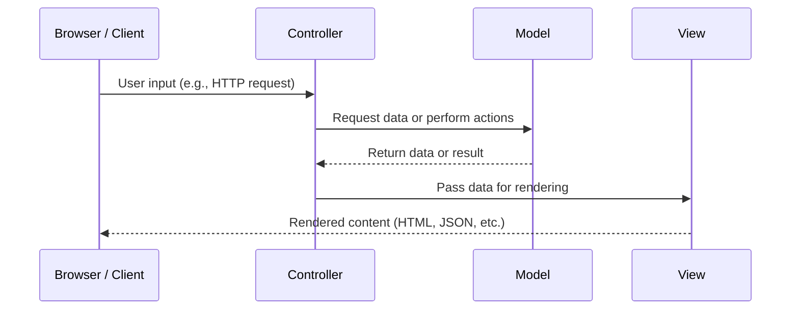
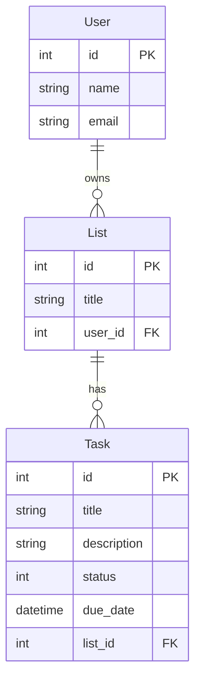

# Jellyfish CTD RoR Course

## Week 8 - April 30 2025

### Displaying Data

Personally, I prefer to understand how the data you receive will be shaped before beginning to imagine how to build the page. Let's look at our Post data.

When we last left off, we had defined the routes for the `Post` model, and set up some controller actions for them that rendered the Posts as `json`.

For now, we are going to focus on the **`#index`** action for `Post`.

If we navigate to our `/posts` endpoint right now, we'll see something like this:

```json
[
  {
    "id": 1,
    "title": "A Title",
    "body": "Fine. heres a body",
    "created_at": "2025-04-10T00:31:23.340Z",
    "updated_at": "2025-04-10T00:31:23.340Z",
    "author_id": 1
  },
  {
    "id": 2,
    "title": "This is a new post",
    "body": "this is a new body",
    "created_at": "2025-04-17T00:45:41.393Z",
    "updated_at": "2025-04-17T00:45:41.393Z",
    "author_id": 1
  },
]
```

But what if we want to show the data in a more fun, appealing way? We're ready to learn a bit more about the **View** part of our Model-View-Controller application.

Before we do, let's refresh our steps from last time:

#### Creating the route

Let's create some route for the Post Model. In `config/routes.rb`, we will add a definition for the routes:

```ruby
resources :posts
```

This creates all of the CRUD routes for the `Post` model. We could just create the route for the `#index` action by specifying `only: :index` after the `resources :posts` definition, however, we know we want to support the other CRUD actions, too.

> **Remember**: An `#index` route should return a collection of resources. (See [Week 6](#week-6---april-16-2025) for a refresher)

#### Creating the Controller

We will create a controller action to handle this route in the `PostsController` (`/app/controllers/posts_controller.rb`)

We want to retreive all of the `Post` records, with the newest records showing first.

```ruby
class PostsController < ApplicationController
  def index
    @posts = Post.all.order(created_at: :desc)
  end
end
```

#### Coming up with a layout

This is what your lesson refers to as *wireframing*. You can do this using tools like Figma or Moqup, or by hand with pen and paper.

It is nice to have a general sense of how the page should be laid out before you start writing your view. In the enterprise world, a UX designer will provide an developer with designs for the page they are expected to build.


> [Image Credit](https://www.behance.net/gallery/96544243/Bandsintown-Mobile-App-Redesign?tracking_source=project_owner_other_projects)


#### Working with ERB

After we are sure of the layout, we can start to write our view template. Out of the box, Rails ships with **ERB**, or Embedded Ruby, as its templating language for defining views.

ERB lets us write Ruby code within an HTML file, which Rails uses to generate dynamic content for our application.

##### ERB Syntax Overview

An ERB file is *mostly HTML,* but there are two important syntax distinctions to note about using ERB:

1. `<% %>` - Run Ruby code without output
   This is used for control flow, loops, and conditionals, where we do not wish the output to render anything, itself

   ```erb
   <% @posts.each do |post| %>
    ...
   <% end %>
   ```

2. `<%= %>` — Run Ruby Code and output the result
   This inserts the result of our Ruby code into the HTML

   ```erb
   <h2><%= @post.title %></h2>
   ```

##### Writing the Template

> 💡 **FYI**: You may have noticed the `@var` we declared in the controller. The instance variables we declare in our controllers are available in our views. This means we can call `@posts` in our ERB file, and receive the value stored under that variable.

```erb
<h1 class="page-title">Posts</h1>

<div class="posts-list">
  <% @posts.each do |post| %>
    <div class="post-card">
      <h2 class="post-title"><%= post.title %></h2>
      <div class="post-meta">
        By: <%= post.author %> (<em><%= post.created_at.strftime("%B %d, %Y") %></em>)
      </div>
      <div class="post-body">
        <%= truncate(post.body, length: 200) %>
      </div>
    </div>
  <% end %>
</div>
```

---

## Week 7 - April 23 2025

NO MENTOR SESSION

---

## Week 6 - April 16 2025

**At its most basic, the primary responsibility of Rails is to take an HTTP request and generate a properly formatted Response.**

We do this by defining routes, creating a controller to handle those routes and creating a template for rendering the data for that route.

## Request-Response Cycle

1. User goes to `https://codethedream.org/` in their web browser
2. A DNS Lookup is performed.
   1. The browser checks its cache or sends a request to a **Domain Name System (DNS)** server to resolve the domain to an IP address. DNS is like the phonebook of the internet: It maps domain names to IP addresses.
      1. This is a simplification of how DNS lookup works, but understanding the process of DNS is worth the read. Check out this [article from Cloudflare on DNS](https://www.cloudflare.com/learning/dns/what-is-dns/) for more information.
   2. You can look up the IP address of a website with `nslookup [URL]` in your terminal
3. The browser opens a **TCP (transmission control protocol)** connection to the server.
4. A **TLS (Transport Layer Security**, formerly known as Secure Sockets Layer or SSL) handshake is performed between the client (browser) and the server
5. The HTTP request is sent to the server: `GET /`
6. The server receives the request
7. The response is built*
8. The response is sent back as an HTTP response to the client 

Building the response is where your Rails Application comes in, and it's definitely more complex than a single sentence. We will come back to that shortly, but for now, let's review some backend concepts.

## REST APIs

- What is an API?
  - _Application Programming Interface_) is a software intermediary whose job is to allow two computers to communicate with one another.
- What is REST?
  - REST stands for "REpresentational State Transfer". It is an architectural style, often applied to APIs, used to create a reliable, high-performance application with a simple, layered interface.
- What is CRUD?
  - _Create, Read, Update, and Delete_ is an acronym that explains the four standard commands for interacting with databases.

### REST vs CRUD: _What's the Difference?_

It can be easy to confuse REST and CRUD, especially when it feels like they're used interchangeably at times, but in simplest terms: REST refers to the structural design of the API while CRUD defines manners in which we may interact with it.

If you're a metaphor person:

- API is your local library, allow you and your favorite books to interact
- REST is the way your local library organizes its books
- CRUD is the set of actions you can take with library resources
- HTTP is the library's process for you to access their resources.
  - No library card might result in `403 Forbidden`

### HTTP Methods

With RESTful APIs, the CRUD functions can be equated with _HTTP Methods_ (also called "_HTTP verbs_") that developers use to interact with the API.

| HTTP Methods | CRUD          | Action                                                                                                                                    |
| ------------ | ------------- | ----------------------------------------------------------------------------------------------------------------------------------------- |
| **GET**      | Read          | Retreives data                                                                                                                            |
| **POST**     | Create        | Creates a new resource                                                                                                                    |
| **PATCH**    | Update        | Makes partial update to an existing resource                                                                                              |
| **PUT**      | Update/Create | Updates entire representation of an exisiting resource **OR** Creates a new resource if the client supplies an ID that does not yet exist |
| **DELETE**   | Delete        | Deletes a resource                                                                                                                        |

## Model View Controller

Rails is a Model-View-Controller (MVC) framework. MVC is a software design pattern used for developing applications that divide the program logic into three interconnected elements: The **model**, **view**, and **controller**.

### **Model**

- **What it does:** Handles the **data** and **business logic**.
- **Responsibilities:**
  - Manages the state of the application.
  - Interacts with the database or API.
  - Enforces rules, validations, and calculations.
- **Example:** In a blog app, a `Post` model might define what a post is, ensure it has a title and body, and connect to the database to fetch or save posts.

### **View**

- **What it does:** Handles the **user interface**.
- **Responsibilities:**
  - Presents data to the user.
  - Displays HTML, JSON, or any UI format.
  - Doesn’t contain business logic.
- **Example:** A template that shows a list of blog posts in HTML.

### **Controller**

- **What it does:** Acts as the **go-between** for the Model and the View.
- **Responsibilities:**
  - Receives user input (like form submissions or URL requests).
  - Tells the model what to do (e.g., save a new post).
  - Chooses the correct view to render in response.
- **Example:** A `PostsController` might have an action like `create` that takes form input, creates a new post via the model, and then redirects or renders a view.



## Defining Routes

- [Rails Routing from the Outside In](https://guides.rubyonrails.org/routing.html)

Routes are defined in our `config/routes.rb` file:

```ruby
Rails.appplication.routes.draw do
  get "/dogs", to: "dogs#index"

  resources :posts do
    resources :comments
  end
end
```

> 💡FYI We can see all of the routes that exist in our rails app in local development by visiting `http://localhost:3000/rails/info/routes` or by running `rails routes` in our terminal!

---

## Week 5 - April 9 2025

### A Quick Detour: Blocks in Ruby

A **block** is an encapsulated piece of code. It's like an anonymous function or a *closure*. Blocks are used all over Ruby, especially in iterators!

> FYI: You can run any of the below examples in your Interactive Ruby Console by running `irb` in your terminal! (see [IRB github](https://github.com/ruby/irb))

#### Multiline Block

Multi line blocks are defined with `do...end`

```ruby
3.times do
  puts "Hello from a multi line block!"
end
```

#### Single line block

Single line blocks are defined with `{}`

```ruby
3.times { puts "Hello from a multi line block!" }
```

#### Arguments in Blocks

Arguments for blocks are passed between pipe characters `|`

```ruby
array = [1,2,3]

array.each_with_index do |num, index|
  puts num, index
end
```

### Writing Tests

#### Why do we test?

- Ensure code behaves as expected
- Catch bugs early
- Document expected behavior
- Enable safe refactoring
- Confidence in deploying code
- Easier collaboration
- Fewer regressions
- Faster feedback loop in development

#### What do we test?

- Models
- Controllers
- Views
- Integrations

Typically, we pattern test files that match our application files, 1:1 (eg. *If we have a user model file, we have a user model test file*)  

### RSpec

- A gem for writing tests in Ruby
- Has a rails specific integration `rspec-rails`
- Uses a Domain Specific Language (DSL) which is sort of like a mini-programming language built using another programming language to communicate commands to a computer

> :star: MUST READ: https://www.betterspecs.org/ 
>
> This is by far the most valuable resource about how to write quality tests in Rspec that I have ever found!
> I highly recommend reading this!

#### `describe`, `context`, `it` Blocks

- `describe` - Used to group tests together
- `context` - express conditions or states
- `it` - defines individual test cases

```ruby
Rspec.describe User do
  context "when user is an admin" do
    it "return true for #admin?" do
      user = User.new(role: "admin")
      expect(user.admin?).to be true
    end
  end
end
```

#### Matchers

- `eq` - equals
- `be_truthy`
- `exist`
- `change`
- and more...see [Rspec Documentation](https://rspec.info/documentation/3.9/rspec-expectations/RSpec/Matchers.html)

```ruby
Rspec.describe "Math" do
  it "adds numbers correctly" do
    expect(2 + 2).to eq(4)
  end
end
```

#### Hooks

Hooks help keep tests DRY (*do not repeat yourself*)

- `before` - defines a setup block before a test, for any actions that may need to happen before test run
- `let`/`let!` - defines variables for our test blocks, `let` is lazy loaded, meaning it will never be instanciated if it is never called in the code that follows
- `subject` - define the main object that we are testing

### Test-Driven Development

Test Driven Development is where we write tests before we write our application code!

- **Red-Green-Refactor**
  - **Red**: Write failing tests
  - **Green**: Write minimum code to make tests pass
  - **Refactor**: Clean-up code, add more tests if necessary

#### Benefits of TDD

- Forces thoughtful design
- Encourages writing only necessary code
- Leads to better test coverage

---

## Week 4 - April 2 2025

### Data modeling: How to decide on models and relationships for our apps?

#### Example: Task Management/To Do List App

- Models
  - Task
    - title
    - description
    - status
    - due date
    - belong to a list
  - User
    - name
    - email
  - List
    - title
    - belong to a user



#### Example: Library Management App

- Models
  - Book
  - Section(Genre, DewDecimal)
  - Author
  - Member (User)
  - BorrowRecord (CheckoutHistory) (Loan)
- Relationships

### Rails app project structure

- `app` → Holds the core components of the application.
  - `assets` → Stores static assets like images, stylesheets, and JavaScript files.
  - `controllers` → Contains controller classes, which handle HTTP requests and coordinate model and view interactions.
  - `helpers` → Stores helper modules that provide reusable methods for `views`.
  - `javascript` → Holds JavaScript and frontend assets when using Webpacker or Import Maps.
  - `jobs` → Contains background jobs for Active Job, which allows asynchronous processing (e.g., email sending).
  - `mailers` → Defines mailer classes for sending emails using Action Mailer.
  - `models`→ Stores model classes, which interact with the database and represent business logic.
  - `views`→ Holds view templates (ERB, HAML, etc.) for rendering HTML responses.
- `bin` → Contains Rails executables like `rails`, `rake`, and `setup`. Used for running commands like `bin/rails server`.
- `config` → Stores application settings and environment configurations.
  - `environments`→ Holds environment-specific settings for `development`, `test`, and `production`.
  - `initializers` → Contains scripts that run during app initialization, such as configuring third-party gems.
- `db` → Stores database-related files, including migrations (`db/migrate/`), schema (`db/schema.rb`), and seeds (`db/seeds.rb`).
- `lib` → Holds custom Ruby modules, services, and extensions that don’t belong in `app/`
- `log` → Stores application logs, such as `development.log`, `test.log`, and `production.log`.
- `public` → Contains static files like `robots.txt`, error pages (`404.html`), and uploaded assets.
- `script` → Previously used for running scripts; now replaced by `bin/`.
- `storage` → Stores files for Active Storage, such as user uploads.
- `test` → Contains test files when using Rails' built-in test framework (`Minitest`).
- `tmp` → Stores temporary files, such as cache, PIDs, and session data.
- `vendor` → Stores third-party code and dependencies (rarely used today due to Bundler).
- `config.ru` → Rack configuration file for running the Rails app with a Rack-based server (e.g., Puma).
- `Dockerfile` → Defines instructions for containerizing the Rails app using Docker.
- `Gemfile` → Lists dependencies managed by Bundler (`gem install`).
- `Rakefile` → Defines Rake tasks for automation, such as running migrations (`rake db:migrate`).

### Rails Initialization Order

*What order to the files in our Rails app load?*
This is important to know if we add dependencies (aka *Gems*) to our app that need to be loaded in a certain order. Understanding where to insert them if you are running into trouble is valuable.

  1. `config/boot.rb`
  2. `config/application.rb`
  3. `config.ru`
  4. `config/environment.rb`
  5. `config/environments/development.rb`
  6. `config/initializers/*` (NOTE: all initializer files are loaded in order of their file name)
  7. `config/puma.rb`
  8. `config/routes.rb` (after an HTTP request is made)

## Week 3 - March 26 2025

- Active Record Associations
  - Types of Associations
    - **One-to-Many** Relationship: `belongs_to` and `has_many`
    - **One-to-One** Relationship: `belongs_to` and `has_one`
      - Drivers License → Person
    - **Many-to-Many** Relationship: `has_many :through` and `has_many`
      - Using a *join* (aka *association*, aka *relational*) *table* to create a Many-to-Many relationship
      - Teachers and Students, with a `students_teachers` join table
      - Doctors and Patients (Appointments as the join table)
    - [Polymorphic Relationships](https://guides.rubyonrails.org/association_basics.html#polymorphic-associations)
  - Object Relational Mapper (ORM)
    - ActiveRecord generates a lot of methods for us to interact with our objects without us having to define those methods
- **Active Record Migrations**
  - `bin/rails db:migrate`
  - `bin/rails db:rollback`
  - `bin/rails generate [migration | model | scaffold] ...`
  - 
- **Object Oriented Programming**
  - Building Blocks of Object-Oriented Programming
    - **Abstraction** - Take complex process and reduce it to a simple interface
    - **Polymorphism** - Allowing objects to behave differently based on their context, allowing classes to be treated as objects of a common type.
    - **Inheritance** - Child class can interit methods and properties from its parent
    - **Encapsulation** - Restricting direct access to an objects properties (getters/setters) and bundling of data with the methods that operate on that data.
  - Read more: [Introduction to Object Oriented Programming](https://www.geeksforgeeks.org/introduction-of-object-oriented-programming)

## Week 2 - March 19 2025

- `!` `?` Methods
  - Ruby has special naming convention for certain methods
  - If a method ends in an `!` it means it is "destructive" or it raises so error
    - In active record world, `!` methods raise errors when things go wrong
      - `save` will fail silently, `save!` will raise an error
  - If a method ends in a `?`, it means the return of the method is a boolean
    - `#active?` it will return `true` or `false` depending on if the instance is `active`
- Classes and Instances: Review
  - A *Class* is a blueprint
    - A class is a table in the database
  - An *instance*, or an *object*, is a class realized
    - An instance is a row in the table in the database
- Relationship modeling
  - relationship describe the **cardinality** (numerical relationship) between the rows of one table and the rows of another
    - the cardinality between objects/instances
    - Entity-Relationships, modeled visually as ERD (Entity-Relationship Diagrams)
  - `belongs_to` (one-to-many)
  - `has_many` (one-to-many) inverse of `belongs_to`
- SQL
  - SQL (Structured Query Language) is a language for maintaining and managing data in a database
  - SQL can be used with a variety of Database Systems (sqlite, MySQL, Postgres (PSQL), Oracle, etc.)
  - SQL is for *relational databases*

### Rails vs SQL

Anything Rails can do with our data models, SQL can do natively, because *secretly*, our Rails app is calling SQL for us under the hood!

You can see SQL being performed by your rails app in the log lines that print in the Rails console.

#### Create a table

##### Rails

```ruby
# db/migrate/20250319234716_create_posts.rb

class CreatePosts < ActiveRecord::Migration[8.0]
  def change
    create_table :posts do |t|
      t.string :title
      t.string :body
      t.timestamps
    end
  end
end
```

##### SQL

```sql
CREATE TABLE posts (
    id INTEGER PRIMARY KEY
    title TEXT
    body TEXT
    updated_at DATETIME
    created_at DATETIME
);
```

#### Create records

##### Rails

```ruby
Post.create!(title: 'This is a Title', body: 'This is a body')
```

##### SQL

```sql
INSERT INTO posts ("title", "body", "updated_at", "created_at") VALUES ('This is a Title', 'This is a body', '2025-03-19 00:00:00', '2025-03-19 00:00:00');
```

#### Update records

##### Rails

```ruby
comment = Comment.first
comment.update!(post_id: 2)
```

##### SQL

```sql
UPDATE "comments" SET "post_id" = 2, "updated_at" = '2025-03-20 00:20:56.993542' WHERE "comments"."id" = 1;
```
