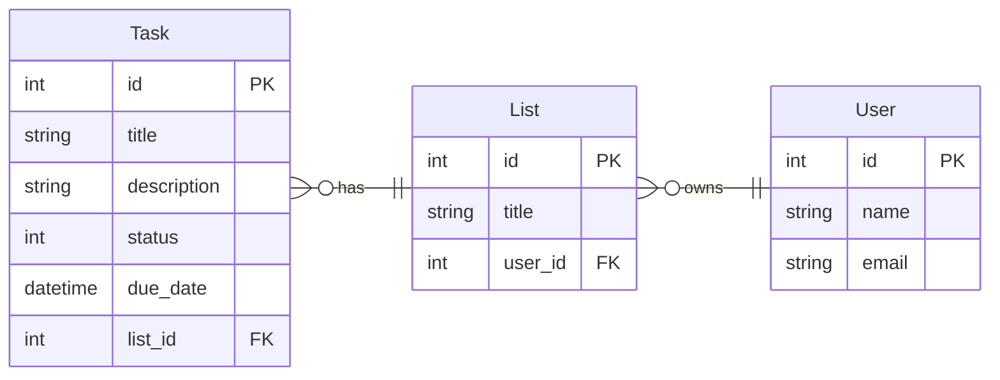

# Jellyfish CTD RoR Course

## Week 4 - April 2 2025

### Data modeling: How to decide on models and relationships for our apps?

#### Example: Task Management/To Do List App

- Models
  - Task
    - title
    - description
    - status
    - due date
    - belong to a list
  - User
    - name
    - email
  - List
    - title
    - belong to a user



#### Example: Library Management App

- Models
  - Book
  - Section(Genre, DewDecimal)
  - Author
  - Member (User)
  - BorrowRecord (CheckoutHistory) (Loan)
- Relationships

### Rails app project structure

- `app` → Holds the core components of the application.
  - `assets` → Stores static assets like images, stylesheets, and JavaScript files.
  - `controllers` → Contains controller classes, which handle HTTP requests and coordinate model and view interactions.
  - `helpers` → Stores helper modules that provide reusable methods for `views`.
  - `javascript` → Holds JavaScript and frontend assets when using Webpacker or Import Maps.
  - `jobs` → Contains background jobs for Active Job, which allows asynchronous processing (e.g., email sending).
  - `mailers` → Defines mailer classes for sending emails using Action Mailer.
  - `models`→ Stores model classes, which interact with the database and represent business logic.
  - `views`→ Holds view templates (ERB, HAML, etc.) for rendering HTML responses.
- `bin` → Contains Rails executables like `rails`, `rake`, and `setup`. Used for running commands like `bin/rails server`.
- `config` → Stores application settings and environment configurations.
  - `environments`→ Holds environment-specific settings for `development`, `test`, and `production`.
  - `initializers` → Contains scripts that run during app initialization, such as configuring third-party gems.
- `db` → Stores database-related files, including migrations (`db/migrate/`), schema (`db/schema.rb`), and seeds (`db/seeds.rb`).
- `lib` → Holds custom Ruby modules, services, and extensions that don’t belong in `app/`
- `log` → Stores application logs, such as `development.log`, `test.log`, and `production.log`.
- `public` → Contains static files like `robots.txt`, error pages (`404.html`), and uploaded assets.
- `script` → Previously used for running scripts; now replaced by `bin/`.
- `storage` → Stores files for Active Storage, such as user uploads.
- `test` → Contains test files when using Rails' built-in test framework (`Minitest`).
- `tmp` → Stores temporary files, such as cache, PIDs, and session data.
- `vendor` → Stores third-party code and dependencies (rarely used today due to Bundler).
- `config.ru` → Rack configuration file for running the Rails app with a Rack-based server (e.g., Puma).
- `Dockerfile` → Defines instructions for containerizing the Rails app using Docker.
- `Gemfile` → Lists dependencies managed by Bundler (`gem install`).
- `Rakefile` → Defines Rake tasks for automation, such as running migrations (`rake db:migrate`).

### Rails Initialization Order

*What order to the files in our Rails app load?*
This is important to know if we add dependencies (aka *Gems*) to our app that need to be loaded in a certain order. Understanding where to insert them if you are running into trouble is valuable.

  1. `config/boot.rb`
  2. `config/application.rb`
  3. `config.ru`
  4. `config/environment.rb`
  5. `config/environments/development.rb`
  6. `config/initializers/*` (NOTE: all initializer files are loaded in order of their file name)
  7. `config/puma.rb`
  8. `config/routes.rb` (after an HTTP request is made)

## Week 3 - March 26 2025

- Active Record Associations
  - Types of Associations
    - **One-to-Many** Relationship: `belongs_to` and `has_many`
    - **One-to-One** Relationship: `belongs_to` and `has_one`
      - Drivers License → Person
    - **Many-to-Many** Relationship: `has_many :through` and `has_many`
      - Using a *join* (aka *association*, aka *relational*) *table* to create a Many-to-Many relationship
      - Teachers and Students, with a `students_teachers` join table
      - Doctors and Patients (Appointments as the join table)
    - [Polymorphic Relationships](https://guides.rubyonrails.org/association_basics.html#polymorphic-associations)
  - Object Relational Mapper (ORM)
    - ActiveRecord generates a lot of methods for us to interact with our objects without us having to define those methods
- **Active Record Migrations**
  - `bin/rails db:migrate`
  - `bin/rails db:rollback`
  - `bin/rails generate [migration | model | scaffold] ...`
  - 
- **Object Oriented Programming**
  - Building Blocks of Object-Oriented Programming
    - **Abstraction** - Take complex process and reduce it to a simple interface
    - **Polymorphism** - Allowing objects to behave differently based on their context, allowing classes to be treated as objects of a common type.
    - **Inheritance** - Child class can interit methods and properties from its parent
    - **Encapsulation** - Restricting direct access to an objects properties (getters/setters) and bundling of data with the methods that operate on that data.
  - Read more: [Introduction to Object Oriented Programming](https://www.geeksforgeeks.org/introduction-of-object-oriented-programming)

## Week 2 - March 19 2025

- `!` `?` Methods
  - Ruby has special naming convention for certain methods
  - If a method ends in an `!` it means it is "destructive" or it raises so error
    - In active record world, `!` methods raise errors when things go wrong
      - `save` will fail silently, `save!` will raise an error
  - If a method ends in a `?`, it means the return of the method is a boolean
    - `#active?` it will return `true` or `false` depending on if the instance is `active`
- Classes and Instances: Review
  - A *Class* is a blueprint
    - A class is a table in the database
  - An *instance*, or an *object*, is a class realized
    - An instance is a row in the table in the database
- Relationship modeling
  - relationship describe the **cardinality** (numerical relationship) between the rows of one table and the rows of another
    - the cardinality between objects/instances
    - Entity-Relationships, modeled visually as ERD (Entity-Relationship Diagrams)
  - `belongs_to` (one-to-many)
  - `has_many` (one-to-many) inverse of `belongs_to`
- SQL
  - SQL (Structured Query Language) is a language for maintaining and managing data in a database
  - SQL can be used with a variety of Database Systems (sqlite, MySQL, Postgres (PSQL), Oracle, etc.)
  - SQL is for *relational databases*

### Rails vs SQL

Anything Rails can do with our data models, SQL can do natively, because *secretly*, our Rails app is calling SQL for us under the hood!

You can see SQL being performed by your rails app in the log lines that print in the Rails console.

#### Create a table

##### Rails

```ruby
# db/migrate/20250319234716_create_posts.rb

class CreatePosts < ActiveRecord::Migration[8.0]
  def change
    create_table :posts do |t|
      t.string :title
      t.string :body
      t.timestamps
    end
  end
end
```

##### SQL

```sql
CREATE TABLE posts (
    id INTEGER PRIMARY KEY
    title TEXT
    body TEXT
    updated_at DATETIME
    created_at DATETIME
);
```

#### Create records

##### Rails

```ruby
Post.create!(title: 'This is a Title', body: 'This is a body')
```

##### SQL

```sql
INSERT INTO posts ("title", "body", "updated_at", "created_at") VALUES ('This is a Title', 'This is a body', '2025-03-19 00:00:00', '2025-03-19 00:00:00');
```

#### Update records

##### Rails

```ruby
comment = Comment.first
comment.update!(post_id: 2)
```

##### SQL

```sql
UPDATE "comments" SET "post_id" = 2, "updated_at" = '2025-03-20 00:20:56.993542' WHERE "comments"."id" = 1;
```
