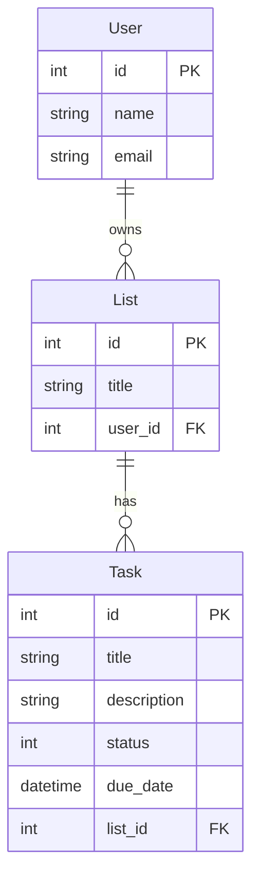

# Week 4: Rails App Structure and Data Modeling

- [Week 4: Rails App Structure and Data Modeling](#week-4-rails-app-structure-and-data-modeling)
  - [Data modeling: How to decide on models and relationships for our apps?](#data-modeling-how-to-decide-on-models-and-relationships-for-our-apps)
    - [Example: Task Management/To Do List App](#example-task-managementto-do-list-app)
    - [Example: Library Management App](#example-library-management-app)
  - [Rails app project structure](#rails-app-project-structure)
  - [Rails Initialization Order](#rails-initialization-order)

## Data modeling: How to decide on models and relationships for our apps?

### Example: Task Management/To Do List App

- Models
  - Task
    - title
    - description
    - status
    - due date
    - belong to a list
  - User
    - name
    - email
  - List
    - title
    - belong to a user

### Example: Library Management App

- Models
  - Book
  - Section(Genre, DewDecimal)
  - Author
  - Member (User)
  - BorrowRecord (CheckoutHistory) (Loan)
- Relationships

## Rails app project structure

- `app` → Holds the core components of the application.
  - `assets` → Stores static assets like images, stylesheets, and JavaScript files.
  - `controllers` → Contains controller classes, which handle HTTP requests and coordinate model and view interactions.
  - `helpers` → Stores helper modules that provide reusable methods for `views`.
  - `javascript` → Holds JavaScript and frontend assets when using Webpacker or Import Maps.
  - `jobs` → Contains background jobs for Active Job, which allows asynchronous processing (e.g., email sending).
  - `mailers` → Defines mailer classes for sending emails using Action Mailer.
  - `models`→ Stores model classes, which interact with the database and represent business logic.
  - `views`→ Holds view templates (ERB, HAML, etc.) for rendering HTML responses.
- `bin` → Contains Rails executables like `rails`, `rake`, and `setup`. Used for running commands like `bin/rails server`.
- `config` → Stores application settings and environment configurations.
  - `environments`→ Holds environment-specific settings for `development`, `test`, and `production`.
  - `initializers` → Contains scripts that run during app initialization, such as configuring third-party gems.
- `db` → Stores database-related files, including migrations (`db/migrate/`), schema (`db/schema.rb`), and seeds (`db/seeds.rb`).
- `lib` → Holds custom Ruby modules, services, and extensions that don’t belong in `app/`
- `log` → Stores application logs, such as `development.log`, `test.log`, and `production.log`.
- `public` → Contains static files like `robots.txt`, error pages (`404.html`), and uploaded assets.
- `script` → Previously used for running scripts; now replaced by `bin/`.
- `storage` → Stores files for Active Storage, such as user uploads.
- `test` → Contains test files when using Rails' built-in test framework (`Minitest`).
- `tmp` → Stores temporary files, such as cache, PIDs, and session data.
- `vendor` → Stores third-party code and dependencies (rarely used today due to Bundler).
- `config.ru` → Rack configuration file for running the Rails app with a Rack-based server (e.g., Puma).
- `Dockerfile` → Defines instructions for containerizing the Rails app using Docker.
- `Gemfile` → Lists dependencies managed by Bundler (`gem install`).
- `Rakefile` → Defines Rake tasks for automation, such as running migrations (`rake db:migrate`).

## Rails Initialization Order

*What order to the files in our Rails app load?*
This is important to know if we add dependencies (aka *Gems*) to our app that need to be loaded in a certain order. Understanding where to insert them if you are running into trouble is valuable.

  1. `config/boot.rb`
  2. `config/application.rb`
  3. `config.ru`
  4. `config/environment.rb`
  5. `config/environments/development.rb`
  6. `config/initializers/*` (NOTE: all initializer files are loaded in order of their file name)
  7. `config/puma.rb`
  8. `config/routes.rb` (after an HTTP request is made)