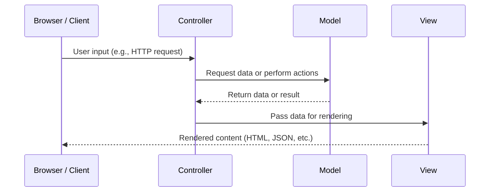

# Week 6: The Request Response Cycle, All About HTTP, Model View Controller

- [Week 6: The Request Response Cycle, All About HTTP, Model View Controller](#week-6-the-request-response-cycle-all-about-http-model-view-controller)
  - [Request-Response Cycle](#request-response-cycle)
  - [REST APIs](#rest-apis)
  - [REST vs CRUD: _What's the Difference?_](#rest-vs-crudwhats-the-difference)
  - [HTTP Methods](#http-methods)
  - [Model View Controller](#model-view-controller)
    - [**Model**](#model)
    - [**View**](#view)
    - [**Controller**](#controller)
  - [Defining Routes](#defining-routes)

**At its most basic, the primary responsibility of Rails is to take an HTTP request and generate a properly formatted Response.**

We do this by defining routes, creating a controller to handle those routes and creating a template for rendering the data for that route.

## Request-Response Cycle

1. User goes to `https://codethedream.org/` in their web browser
2. A DNS Lookup is performed.
   1. The browser checks its cache or sends a request to a **Domain Name System (DNS)** server to resolve the domain to an IP address. DNS is like the phonebook of the internet: It maps domain names to IP addresses.
      1. This is a simplification of how DNS lookup works, but understanding the process of DNS is worth the read. Check out this [article from Cloudflare on DNS](https://www.cloudflare.com/learning/dns/what-is-dns/) for more information.
   2. You can look up the IP address of a website with `nslookup [URL]` in your terminal
3. The browser opens a **TCP (transmission control protocol)** connection to the server.
4. A **TLS (Transport Layer Security**, formerly known as Secure Sockets Layer or SSL) handshake is performed between the client (browser) and the server
5. The HTTP request is sent to the server: `GET /`
6. The server receives the request
7. The response is built*
8. The response is sent back as an HTTP response to the client

Building the response is where your Rails Application comes in, and it's definitely more complex than a single sentence. We will come back to that shortly, but for now, let's review some backend concepts.

## REST APIs

- What is an API?
  - _Application Programming Interface_ is a software intermediary whose job is to allow two computers to communicate with one another.
- What is REST?
  - REST stands for "REpresentational State Transfer". It is an architectural style, often applied to APIs, used to create a reliable, high-performance application with a simple, layered interface.
- What is CRUD?
  - _Create, Read, Update, and Delete_ is an acronym that explains the four standard commands for interacting with databases.

## REST vs CRUD: _What's the Difference?_

It can be easy to confuse REST and CRUD, especially when it feels like they're used interchangeably at times, but in simplest terms: REST refers to the structural design of the API while CRUD defines manners in which we may interact with it.

If you're a metaphor person:

- API is your local library, allow you and your favorite books to interact
- REST is the way your local library organizes its books
- CRUD is the set of actions you can take with library resources
- HTTP is the library's process for you to access their resources.
  - No library card might result in `403 Forbidden`

## HTTP Methods

With RESTful APIs, the CRUD functions can be equated with _HTTP Methods_ (also called "_HTTP verbs_") that developers use to interact with the API.

| HTTP Methods | CRUD          | Action                                                                                                                                    |
| ------------ | ------------- | ----------------------------------------------------------------------------------------------------------------------------------------- |
| **GET**      | Read          | Retreives data                                                                                                                            |
| **POST**     | Create        | Creates a new resource                                                                                                                    |
| **PATCH**    | Update        | Makes partial update to an existing resource                                                                                              |
| **PUT**      | Update/Create | Updates entire representation of an exisiting resource **OR** Creates a new resource if the client supplies an ID that does not yet exist |
| **DELETE**   | Delete        | Deletes a resource                                                                                                                        |

## Model View Controller

Rails is a Model-View-Controller (MVC) framework. MVC is a software design pattern used for developing applications that divide the program logic into three interconnected elements: The **model**, **view**, and **controller**.

### **Model**

- **What it does:** Handles the **data** and **business logic**.
- **Responsibilities:**
  - Manages the state of the application.
  - Interacts with the database or API.
  - Enforces rules, validations, and calculations.
- **Example:** In a blog app, a `Post` model might define what a post is, ensure it has a title and body, and connect to the database to fetch or save posts.

### **View**

- **What it does:** Handles the **user interface**.
- **Responsibilities:**
  - Presents data to the user.
  - Displays HTML, JSON, or any UI format.
  - Doesn’t contain business logic.
- **Example:** A template that shows a list of blog posts in HTML.

### **Controller**

- **What it does:** Acts as the **go-between** for the Model and the View.
- **Responsibilities:**
  - Receives user input (like form submissions or URL requests).
  - Tells the model what to do (e.g., save a new post).
  - Chooses the correct view to render in response.
- **Example:** A `PostsController` might have an action like `create` that takes form input, creates a new post via the model, and then redirects or renders a view.



## Defining Routes

- [Rails Routing from the Outside In](https://guides.rubyonrails.org/routing.html)

Routes are defined in our `config/routes.rb` file:

```ruby
Rails.appplication.routes.draw do
  get "/dogs", to: "dogs#index"

  resources :posts do
    resources :comments
  end
end
```

> 💡FYI We can see all of the routes that exist in our rails app in local development by visiting `http://localhost:3000/rails/info/routes` or by running `rails routes` in our terminal!
